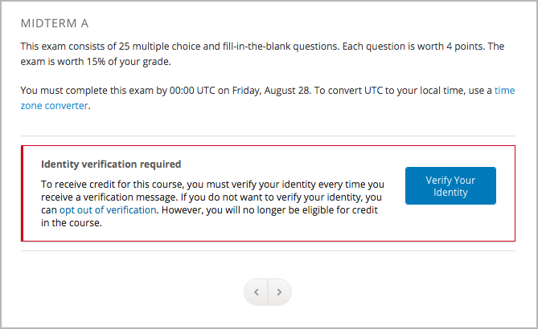
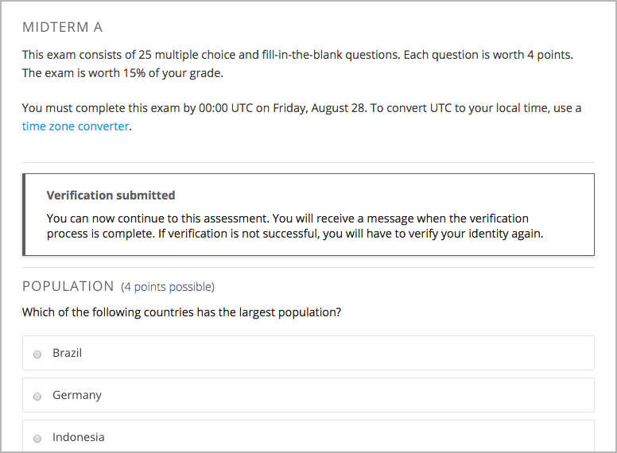

.. _In Course Reverification:

#################################
In-Course Identity Reverification
#################################

To use in-course identity reverification, you must enable reverification in
your course, and create specific verification checkpoints, and then modify the settings for the components and units that you want to hide behind each checkpoint. 

.. contents:: 
 :local:
 :depth: 1

.. _Enable ICRV:

*****************************************
Enable In-Course Identity Reverification
*****************************************

To enable in-course identity reverification for your course, follow these
steps.

#. In Studio, select **Settings**, and then select **Advanced Settings**.
#. In the **Advanced Module List** field, place your cursor between the
   brackets (``[]``),and then add ``"edx-reverification-block"``. Make sure to
   include the quotation marks. 

   .. note:: If the **Advanced Module List** field already contains one or 
    more items, add a comma after the closing quotation mark for the last
    item, and then add ``"edx-reverification-block"``. The field should
    resemble the following example.

    ``["module_name","edx-reverification-block"]``

#. At the bottom of the page, select **Save Changes**.

.. _Create ICRV Checkpoint:

*********************************************
Create a Verification Checkpoint Component
*********************************************

To require learners to verify their identity before a specific assessment, you
create a verification checkpoint in the subsection that contains that
assessment. After you create a checkpoint, the checkpoint appears on the
**Progress** pages and in the courseware for learners who must complete in-
course identity reverification.

.. note:: Although it is possible to add a verification checkpoint at any
 location, edX strongly recommends that you add verification checkpoints only
 before assessments.

#. In the subsection that contains the assessment, create a new unit.

   If the subsection already contains one or more units, move the new unit so
   that it is the first unit in the subsection.

#. In the new unit, locate **Add New Component**, and then select **Advanced**. 

#. Select **Verification Checkpoint**, and then select **Edit**.

#. In the **Verification Checkpoint Name** box, enter a name for the
   verification checkpoint.

#. In the **Verification Attempts** box, select the number of times that
   learners can attempt to verify their identities. You can specify up to
   three attempts.

.. _Require Verification:

*********************************************************
Require Verification to Access an Assessment
*********************************************************

If you want to require learners to pass a verification checkpoint before they
access an assessment, you must change the settings of the components or units
that make up that assessment to require verification.

When you change component or unit settings to require verification, remember
the following guidelines.

* **If a unit is not set to require verification**, all of the components in
  that unit are visible by default. However, you can set individual components
  to require verification. These components are not visible until the learner
  passes the verification checkpoint.

* **If a unit is set to require verification**, none of the components in that
  unit is visible until the learner passes the verification checkpoint. You
  cannot make an individual component visible without verification.

.. important:: Do not set the unit that contains the verification 
 checkpoint component to require verification. If you do this, learners cannot
 access any of the content in the unit, including the verification checkpoint.

For example, you may want a unit to contain some introductory text that is
visible at all times, followed by the verification checkpoint, followed by an
exam question. You do not want learners to see the exam question until they
pass the verification checkpoint.

To accomplish this, you would follow these steps.

#. Create a new unit. Do not change the unit settings.
#. Create one component for the introductory text, and enter your text in the
   component. 
#. Create the verification checkpoint component.
#. Create a component for the question, and enter the content for the
   component.
#. Change the settings of the question component to require verification. Do
   not change the settings of the other components.

For an example of the learner view of this content, see
:ref:`Understand Learner Experience`.

=================================================
Specify a Verification Checkpoint for a Component
=================================================

If only some of the components in a unit require verification, access the
component visibility settings for each component that requires verification,
and then select the verification checkpoint that you want from the list.

.. image:: ../Images/ICRV_CompUnitSettings.png  
  :width: 500
  :alt: The settings editor for a component and for a unit, showing
      verification checkpoints.

.. note:: If you do not change the settings for a component, that component 
 is visible before the learner passes the verification checkpoint.

#. On the unit page, locate the component that you want, and then select
   **Visibility Settings** for that component. The **Visibility Settings**
   control resembles an eye.

#. Under **Make visible to**, select **Specific Content Groups**, and then
   select the verification checkpoint that you want.

   .. image:: ../Images/ICRV_CompSettings.png
    :width: 250
    :alt: The settings editor for a component, showing the list of
      verification checkpoints.

=================================================
Specify a Verification Checkpoint for a Unit
=================================================

If all of the components in a unit require verification, access the unit
settings, and then select the verification checkpoint that you want from the
list.

.. important:: Do not set the unit that contains the verification 
 checkpoint to require verification. If you do this, learners cannot access
 any of the content in the unit, including the verification checkpoint.

#. On the **Course Outline** page, locate the unit that you want, and then
   select **Configure** for that unit. The **Configure** control resembles a
   gear.

#. Under **Verification Checkpoint**, select the name of the verification
   checkpoint that you want.

   .. image:: ../Images/ICRV_UnitSettings.png
    :width: 250
    :alt: The settings editor for a unit, showing the list of verification
      checkpoints.

.. _Understand Learner Experience:

**************************************
Understand the Learner Experience
**************************************
 
Learners who must complete in-course reverification see the verification
checkpoints for their course in the list of course credit requirements on
their **Progress** pages.

.. image:: ../Images/SFD_Credit_ReqList.png
 :width: 350
 :alt: Learner's Progress page with a list of credit requirements below the
     progress graph.

When learners arrive at a checkpoint in the courseware, learners receive a
message that lets them know that they must complete identity verification, and
that if they do not complete identity verification, they will not be eligible
for course credit.

     perform identity verification.

After learners pass the checkpoint, they 

     continue to the assessment.

When learners who do not have to complete in-course identity reverification
arrive at a checkpoint, the learners receive a message about identity
verification and verified certificates. They can access assessment content.

For more information about the in-course identity reverification experience
for the learner, see :ref:`In-Course Identity Reverification <http://edx-guide-for-students.readthedocs.org/en/latest/SFD_credit_courses/SFD_in_course_ID_reverification.html>`.

