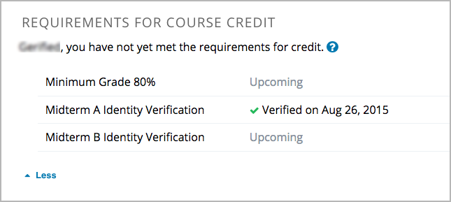

.. _In Course Reverification:

#################################
In-Course Identity Reverification
#################################

To use in-course identity reverification, you must enable reverification in
your course, create specific verification checkpoints, and then set an
assessment to require verification.

.. contents:: 
 :local:
 :depth: 1

.. _Enable ICRV:

*****************************************
Enable In-Course Identity Reverification
*****************************************

To enable in-course identity reverification for your course, follow these
steps.

#. In Studio, select **Settings**, and then select **Advanced Settings**.
#. In the **Advanced Module List** field, place your cursor between the
   brackets (``[]``),and then add ``"edx-reverification-block"``. Make sure to
   include the quotation marks. 

   .. note:: If the **Advanced Module List** field already contains one or 
    more items, add a comma after the closing quotation mark for the last
    item, and then add ``"edx-reverification-block"``. The field should
    resemble the following example.

    ``["module_name","edx-reverification-block"]``

#. At the bottom of the page, select **Save Changes**.

.. _Create ICRV Checkpoint:

*********************************
Create a Verification Checkpoint
*********************************

To require learners to verify their identity before a specific assessment, you
add a verification checkpoint component to a unit in that assessment. After
you create a checkpoint component, the checkpoint appears on the **Progress**
pages and in the courseware for learners who must complete in-course identity
reverification.

.. Not sure about leaving this note in

.. note:: Although it is possible to add a verification checkpoint at any
 location, edX strongly recommends that you add verification checkpoints only
 before assessments.

#. In the subsection that contains the assessment, create a new unit.

   If the subsection already contains one or more units, move the new unit so
   that it is the first unit in the subsection.

#. In the new unit, locate **Add New Component**, and then select **Advanced**. 

#. Select **Verification Checkpoint**, and then select **Edit**.

#. In the **Verification Checkpoint Name** box, enter a name for the
   verification checkpoint.

#. In the **Verification Attempts** box, select the number of times that
   learners can attempt to verify their identities. You can specify up to
   three attempts.

.. _Require Verification:

*********************************************************
Set an Assessment to Require Verification
*********************************************************

After you create a verification checkpoint in an assessment, you must set the
components and units in that assessment to be invisible until learners pass
the checkpoint that you created. You can also leave some components or units
visible.

To make a component or unit invisible, you select the verification checkpoint
in the settings of the component or unit. By default, all components and units
are visible. To leave them visible, do not select a verification checkpoint in
the component or unit settings.

Before you make a component or unit invisible, become familiar with the
following information.

* If you set an entire unit to be invisible until learners pass a verification
  checkpoint, all of the components in that unit are invisible. You cannot
  make an individual component visible.

* If you do not set a unit to be invisible, all of the components in that unit
  are visible by default. However, you can set individual components to be
  invisible until the learner passes the verification checkpoint.

.. important:: Do not set the unit that contains the verification 
 checkpoint component, or the verification component itself, to require
 verification. If you do this, learners cannot access the verification
 checkpoint.

For an example situation in which a unit contains two visible and one
invisible component, see :ref:`Verification Example`.

=================================================
Require Verification for a Component
=================================================

To set a component to be invisible until the learner completes identity
verification, access the component visibility settings for the component, and
then select the verification checkpoint that you want from the list.

.. important:: Do not set the verification checkpoint component itself 
 to require verification. If you do this, learners cannot access the
 verification checkpoint.

#. On the unit page, locate the component that you want, and then select
   **Visibility Settings** for that component. The **Visibility Settings**
   control resembles an eye.

#. Under **Make visible to**, select **Specific Content Groups**, and then
   select the verification checkpoint that you want.

   .. image:: ../Images/ICRV_CompSettings.png
    :width: 250
    :alt: The settings editor for a component, showing the list of
      verification checkpoints.

=================================================
Require Verification for a Unit
=================================================

To require verification for a unit, access the unit settings, and then select
the verification checkpoint that you want from the list.

.. important:: Do not set the unit that contains the verification 
 checkpoint to require verification. If you do this, learners cannot access
 any of the content in the unit, including the verification checkpoint.

#. On the **Course Outline** page, locate the unit that you want, and then
   select **Configure** for that unit. The **Configure** control resembles a
   gear.

#. Under **Verification Checkpoint**, select the name of the verification
   checkpoint that you want.

   .. image:: ../Images/ICRV_UnitSettings.png
    :width: 250
    :alt: The settings editor for a unit, showing the list of verification
      checkpoints.

.. _Verification Example:

=================================================
See an Identity Verification Example
=================================================

In your assessment, you want the first unit to contain some introductory text,
the verification checkpoint, and an exam question. You want the introductory
text to be visible to all learners, regardless of verification. However, you
do not want learners to see the exam question until they pass the verification
checkpoint.

You want all of the components in the remaining units to be invisible until
learners pass the verification checkpoint.

To create this assessment, you would follow these steps.

#. Create a new unit. Do not change the unit settings.
#. Create one component for the introductory text, and enter your text in the
   component. 
#. Below the introductory text component, create the verification checkpoint
   component.
#. Below the verification checkpoint component, create a component for the
   question, and enter the content for the component.
#. Change the settings of the question component to require verification. Do
   not change the settings of the other components.
#. Create the remaining units and components. Change the settings of each
   remaining unit to require identity verification. You do not have to change
   the settings of the individual components in any of these units.

For the learner view of the first unit, see
:ref:`Understand Learner Experience`.

.. _Understand Learner Experience:

**************************************
Understand the Learner Experience
**************************************
 
Learners who must complete in-course reverification see the verification
checkpoints for their course in the list of course credit requirements on
their **Progress** pages.

     progress graph.

When learners arrive at a checkpoint in the courseware, learners receive a
message that lets them know that they must complete identity verification, and
that if they do not complete identity verification, they will not be eligible
for course credit.

     perform identity verification.

After learners pass the checkpoint, they 

     continue to the assessment.

When learners who do not have to complete in-course identity reverification
arrive at a checkpoint, the learners receive a message about identity
verification and verified certificates. They can access assessment content.

For more information about the in-course identity reverification experience
for the learner, see
:ref:`In-Course Identity Reverification <http://edx-guide-for-students.readthedocs.org/en/latest/SFD_credit_courses/SFD_in_course_ID_reverification.html>`.